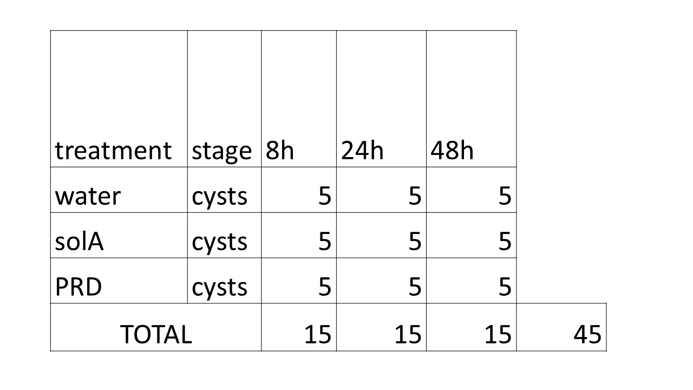

# Introduction
In this file the complete analysis workflow of count data of the Globodera pallida RNAseq experiment is shown.

## Goal

The goal of this experiment is to unravel the effect of solanoeclepin A on the hydrated cysts of G pallida. The set up of this experiment is summarized in this figure:
```{r include = FALSE}
if ("knitr" %in% installed.packages()){
  library("knitr")
} else {
  install.packages("knitr")
  library("knitr")
}
```
```{r setup, include = FALSE}
knitr::opts_knit$set(root.dir = rprojroot::find_rstudio_root_file())
```

```{r figurename, echo=FALSE, out.width = '90%'}

```

## Setup

Packages necessary:

* Checkpoint
* DESeq2
* dplyr
* tidyr
* tidyverse
* Biostrings
* biomaRt
* biomartr
* clusterProfiler
* org.At.tair.db
* tibble
* mixOmics
* vegan
* apeglm
* EnhancedVolcano
* patchwork
* reshape
* pheatmap
* purrr
* ComplexUpset

```{r include=FALSE}
#########
# Library
#########
if ("checkpoint" %in% installed.packages()){
  library("checkpoint") # https://cran.r-project.org/web/packages/checkpoint/index.html
} else {
  install.packages("checkpoint")
  suppressPackageStartupMessages(library("checkpoint"))
  suppressPackageStartupMessages(checkpoint("2021-04-20"))  # all packages in your project will be taken from that date.
}
if ("DESeq2" %in% installed.packages()){
  library("DESeq2")
} else {
  BiocManager::install("DESeq2")
  library("DESeq2")
}
if ("dplyr" %in% installed.packages()){
  library("dplyr")
} else {
  install.packages("dplyr")
  library("dplyr")
}
if ("tidyr" %in% installed.packages()){
  library("tidyr")
} else {
  install.packages("tidyr")
  library("tidyr")
}
if ("tidyverse" %in% installed.packages()){
  library("tidyverse")
} else {
  install.packages("tidyverse")
  library("tidyverse")
}
if ("Biostrings" %in% installed.packages()){
  library("Biostrings") 
} else {
  BiocManager::install("Biostrings")
  library("Biostrings")
}
if ("biomaRt" %in% installed.packages()){
  library("biomaRt") 
} else {
  BiocManager::install("biomaRt")
  library("biomaRt")
}
if ("biomartr" %in% installed.packages()){
  library("biomartr")
} else {
  install.packages("biomartr", dependencies = TRUE)
  library("biomartr")
}
if ("clusterProfiler" %in% installed.packages()){
  library("clusterProfiler") 
} else {
  BiocManager::install("clusterProfiler")
  library("clusterProfiler")
}
if ("org.At.tair.db" %in% installed.packages()){
  library("org.At.tair.db") 
} else {
  BiocManager::install("org.At.tair.db")
  library("org.At.tair.db")
}
if ("tibble" %in% installed.packages()){
  library("tibble") 
} else {
  install.packages("tibble")
  library("tibble")
}
if ("mixOmics" %in% installed.packages()){
  library("mixOmics") 
} else {
  BiocManager::install("mixOmics")
  library("mixOmics")
}
if ("vegan" %in% installed.packages()){
  library("vegan") 
} else {
  install.packages("vegan")
  library("vegan")
}
if ("ashr" %in% installed.packages()){
  library("ashr") 
} else {
  BiocManager::install("ashr")
  library("ashr")
}
if ("EnhancedVolcano" %in% installed.packages()){
  library("EnhancedVolcano") 
} else {
  BiocManager::install("EnhancedVolcano")
  library("EnhancedVolcano")
}
if ("patchwork" %in% installed.packages()){
  library("patchwork") 
} else {
  BiocManager::install("patchwork")
  library("patchwork")
}
if ("reshape" %in% installed.packages()){
  library("reshape") 
} else {
  install.packages("reshape")
  library("reshape")
}
if ("pheatmap" %in% installed.packages()){
  library("pheatmap") 
} else {
  BiocManager::install("pheatmap")
  library("pheatmap")
}
if ("purrr" %in% installed.packages()){
  library("purrr") 
} else {
  BiocManager::install("purrr")
  library("purrr")
}
if ("ComplexUpset" %in% installed.packages()){
  library("ComplexUpset") 
} else {
  BiocManager::install("ComplexUpset")
  library("ComplexUpset")
}
```

# Import and transform counts table and xp_design

Import counts file and clean up. This file is saved into the input/ folder for later use.

```{r counts}
raw_counts <- read.csv("input/count_table_gene.csv", 
                         header = TRUE, 
                         stringsAsFactors = FALSE, 
                         check.names = FALSE, 
                         fileEncoding = "UTF-8-BOM")
raw_counts <- raw_counts[-c(1:5),]
rownames(raw_counts) <- NULL
raw_counts <- raw_counts %>% column_to_rownames("gene_id")
samplelist <- names(raw_counts)
samplelist <- gsub("NS2102_","",samplelist)
samplelist <- substr(samplelist, 1, 5)
samplelist <- gsub("_$", "", samplelist)
names(raw_counts) <- samplelist
counts <- raw_counts[,order(colnames(raw_counts))] %>% rownames_to_column("Geneid")
write.csv(counts, "input/counts.csv", row.names = FALSE)
counts[1:5, 1:5]
```

Compile an xp_design file. This file is saved into the input/ folder for later use.

```{r xp_design}
sample <- names(counts)[2:41]
treatment <- c(rep("PRD", 12), rep("solA", 13), rep("water", 15))
tp <- c(rep("24", 4), rep("48", 3), rep("8", 5), rep("24", 5), rep("48", 4), rep("8", 4), rep("24", 5), rep("48", 5), rep("8", 5))
xp_design <- data.frame(sample, treatment, tp)
xp_design$group <- factor(paste0(xp_design$treatment, "_", xp_design$tp))
write.csv(xp_design, "input/xp_design.csv", row.names = FALSE)
head(xp_design)
```

# PCA analysis

Let's see how the samples cluster in a PCA plot. We take all samples and plot it using the function plot_pca() (all scripts can be found in the scripts/ folder).

```{r PCA_allsamples, message = FALSE, warning = FALSE}
source("scripts/create_pca_plot.R")
p <- plot_pca()
p
```

These seem to cluster mostly on timepoint, because timepoint 8 (circles) are separated from the rest. Timepoint 24 and 48 seem to mix a little. Also, the colours, which indicate treatment, seem to separate within the timepoint, which is good!
Hence, timepoint is the largest source of variation in our experiment, followed by treatment.
Let's look at the PCA plots of individual timepoints.

Figure S1
```{r PCA_per_treatment}
p1 <- plot_pca(tp = 8) + theme_minimal() + guides(shape = FALSE)
p2 <- plot_pca(tp = 24) + theme_minimal() + guides(shape = F)
p3 <- plot_pca(tp = 48) + theme_minimal() + guides(shape = F)

p + p1 + p2 + p3 + plot_layout(ncol = 2)
```
On all individual timepoints, the treatments cluster within the first two components. This means that these are the biggest sources of variation in our experiments.

# DEG analysis

Let's make some volcano plots to visualise the DEGs per timepoint. First for the solA treatment versus water:

```{r}
source("scripts/volcanoplot.R")
source("scripts/get_DESeq_dds.R")
```
```{r volcano1, fig.height = 15, fig.width = 8, warning = FALSE, message = FALSE}
v1 <- make_volcanoplot(trtm = c("water", "solA"), th = 8, log2FC_threshold = 0, FCcutoff_volcano = 1, padj_threshold = 0.05, ttl = "Timepoint 8h, water vs. solA", xsize = 3)
v2 <- make_volcanoplot(trtm = c("water", "solA"), th = 24, log2FC_threshold = 0, FCcutoff_volcano = 1, padj_threshold = 0.05, ttl = "Timepoint 24h, water vs. solA", xsize = 3)
v3 <- make_volcanoplot(trtm = c("water", "solA"), th = 48, log2FC_threshold = 0, FCcutoff_volcano = 1, padj_threshold = 0.05, ttl = "Timepoint 48h, water vs. solA", xsize = 3)
v1 + v2 + v3 + plot_layout(ncol = 1)
```

Let's do the same for the PRD treatment versus water:

```{r volcano2, fig.height = 15, fig.width = 8, warning = FALSE, message = FALSE}
v4 <- make_volcanoplot(trtm = c("water", "PRD"), th = 8, log2FC_threshold = 0, FCcutoff_volcano = 1, padj_threshold = 0.05, ttl = "Timepoint 8h, water vs. PRD", xsize = 4)
v5 <- make_volcanoplot(trtm = c("water", "PRD"), th = 24, log2FC_threshold = 0, FCcutoff_volcano = 1, padj_threshold = 0.05, ttl = "Timepoint 24h, water vs. PRD", xsize = 4)
v6 <- make_volcanoplot(trtm = c("water", "PRD"), th = 48, log2FC_threshold = 0, FCcutoff_volcano = 1, padj_threshold = 0.05, ttl = "Timepoint 48h, water vs. PRD", xsize = 4)

v4 + v5 + v6 + plot_layout(ncol = 1)
```

Possibly it is interesting to see the impact of all the compounds in PRD that are not solanoeclepin A. So check the DEGs of the PRD treatment versus solA:

```{r volcano3, fig.height = 15, fig.width = 8, warning = FALSE, message = FALSE}
v7 <- make_volcanoplot(trtm = c("solA", "PRD"), th = 8, log2FC_threshold = 0, FCcutoff_volcano = 1, padj_threshold = 0.05, ttl = "Timepoint 8h, solA vs. PRD", xsize = 4)
v8 <- make_volcanoplot(trtm = c("solA", "PRD"), th = 24, log2FC_threshold = 0, FCcutoff_volcano = 1, padj_threshold = 0.05, ttl = "Timepoint 24h, solA vs. PRD", xsize = 4)
v9 <- make_volcanoplot(trtm = c("solA", "PRD"), th = 48, log2FC_threshold = 0, FCcutoff_volcano = 1, padj_threshold = 0.05, ttl = "Timepoint 48h, solA vs. PRD", xsize = 4)

v7 + v8 + v9 + plot_layout(ncol = 1)
```

We also need lists of differentially expressed genes per treatment. For that, we can use the function get_list_of_DEGs(). Let's do it first for the solA treated samples and let's count how many DEGs for each timepoint:

```{r DEGslist, message=FALSE, warning=FALSE}
source("scripts/get_DESeq_dds.R")
dds <- get_DESeq_dds()
source("scripts/get_shrunk_filtered_results.R")
solA_8h <- get_shrunk_filtered_results(trtm = c("water", "solA"), th = 8, log2FC_threshold = 0, padj_threshold = 0.05) %>% rownames_to_column("Geneid")

solA_24h <- get_shrunk_filtered_results(trtm = c("water", "solA"), th = 24, log2FC_threshold = 0, padj_threshold = 0.05) %>% rownames_to_column("Geneid")

solA_48h <- get_shrunk_filtered_results(trtm = c("water", "solA"), th = 48, log2FC_threshold = 0, padj_threshold = 0.05) %>% rownames_to_column("Geneid")

write.csv(solA_8h, "output/DEGs_solA_8h.csv", row.names = FALSE)
write.csv(solA_24h, "output/DEGs_solA_24h.csv", row.names = FALSE)
write.csv(solA_48h, "output/DEGs_solA_48h.csv", row.names = FALSE)

nrow(solA_8h)
nrow(solA_24h)
nrow(solA_48h)
```

Let's check if any of these DEGs are overlapping:
```{r overlap_solA, warning = FALSE, message = FALSE}
sum(solA_8h$Geneid %in% solA_24h$Geneid)
sum(solA_8h$Geneid %in% solA_48h$Geneid)
sum(solA_24h$Geneid %in% solA_48h$Geneid)
```

Indeed, 24h and 48h overlap the most but still only 31 DEGs, more than either with the 8h timepoint (21 and 13, respectively).

Let's do the same thing for the PRD treated samples:

```{r DEGslist2, warning = FALSE, message = FALSE}
PRD_8h <- get_shrunk_filtered_results(trtm = c("water", "PRD"), th = 8, log2FC_threshold = 0, padj_threshold = 0.05) %>% rownames_to_column("Geneid")
PRD_24h <- get_shrunk_filtered_results(trtm = c("water", "PRD"), th = 24, log2FC_threshold = 0, padj_threshold = 0.05) %>% rownames_to_column("Geneid")
PRD_48h <- get_shrunk_filtered_results(trtm = c("water", "PRD"), th = 48, log2FC_threshold = 0, padj_threshold = 0.05) %>% rownames_to_column("Geneid")

write.csv(PRD_8h, "output/DEGs_PRD_8h.csv", row.names = FALSE)
write.csv(PRD_24h, "output/DEGs_PRD_24h.csv", row.names = FALSE)
write.csv(PRD_48h, "output/DEGs_PRD_48h.csv", row.names = FALSE)

nrow(PRD_8h)
nrow(PRD_24h)
nrow(PRD_48h)
```

And let's check the overlap:

```{r overlap_PRD, warning = FALSE, message = FALSE}
sum(PRD_8h$Geneid %in% PRD_24h$Geneid)
sum(PRD_8h$Geneid %in% PRD_48h$Geneid)
sum(PRD_24h$Geneid %in% PRD_48h$Geneid)
```

Now, the same is done for the PRD versus solA comparison. Furthermore, a matrix is made to show for each gene if they appear in the list of DEGs for all comparisons. We need this to visualise this information in a Venn diagram or, in this case, an upset plot. An upset plot is a better alternative for a Venn diagram if you have more than 4 groups in the comparison (which is the case for us). 

```{r prepare_for_upset, warning = FALSE, message = FALSE}
solA_8h_incounts <- counts$Geneid %in% solA_8h$Geneid
solA_24h_incounts <- counts$Geneid %in% solA_24h$Geneid
solA_48h_incounts <- counts$Geneid %in% solA_48h$Geneid
PRD_8h_incounts <- counts$Geneid %in% PRD_8h$Geneid
PRD_24h_incounts <- counts$Geneid %in% PRD_24h$Geneid
PRD_48h_incounts <- counts$Geneid %in% PRD_48h$Geneid

#generate lists of DEGs for the PRD vs solA comparisons per timepoint:
PRD_vs_solA_8h <- get_shrunk_filtered_results(trtm = c("solA", "PRD"), th = 8, log2FC_threshold = 0, padj_threshold = 0.05) %>% rownames_to_column("Geneid")
PRD_vs_solA_24h <- get_shrunk_filtered_results(trtm = c("solA", "PRD"), th = 24, log2FC_threshold = 0, padj_threshold = 0.05) %>% rownames_to_column("Geneid")
PRD_vs_solA_48h <- get_shrunk_filtered_results(trtm = c("solA", "PRD"), th = 48, log2FC_threshold = 0, padj_threshold = 0.05) %>% rownames_to_column("Geneid")

#save these lists into the output folder
write.csv(PRD_vs_solA_8h, "output/DEGs_PRDvsSolA_8h.csv", row.names = FALSE)
write.csv(PRD_vs_solA_24h, "output/DEGs_PRDvsSolA_24h.csv", row.names = FALSE)
write.csv(PRD_vs_solA_48h, "output/DEGs_PRDvsSolA_48h.csv", row.names = FALSE)

#generate the TRUE/FALSE lists for the PRD vs solA comparisons per timepoint:
PRD_vs_solA_8h_incounts <- counts$Geneid %in% PRD_vs_solA_8h$Geneid
PRD_vs_solA_24h_incounts <- counts$Geneid %in% PRD_vs_solA_24h$Geneid
PRD_vs_solA_48h_incounts <- counts$Geneid %in% PRD_vs_solA_48h$Geneid

#assemble the matrix
m <- tibble(counts$Geneid, solA_8h_incounts, solA_24h_incounts, solA_48h_incounts, PRD_8h_incounts, PRD_24h_incounts, PRD_48h_incounts, PRD_vs_solA_8h_incounts, PRD_vs_solA_24h_incounts, PRD_vs_solA_48h_incounts) %>% column_to_rownames("counts$Geneid")
mnames <- colnames(m) 
mnames <- gsub("_incounts", "", mnames)
colnames(m) <- mnames
m[1:10, 1:4]
```

Now we have the matrix, but we are not interested in genes that are not differentially expressed in any treatment, so we kick those out. Then we can plot the upset plot with the Complex Upset package (was loaded before).
This plot will only include the PRD and solA comparisons with water (not the PRD with solA comparison).

```{r plot_upset, fig.height=6, fig.width=10, message=FALSE, warning=FALSE}
m$x <- rowSums(m[,mnames])
m <- m[m$x >0,]
m <- m[, 1:9]
  
u <- upset(data = m[, 1:6],
           intersect = mnames[1:6], 
           min_size = 0, 
           min_degree = 1, 
           name = "",
           base_annotations = list('Intersection size' = intersection_size(
             text = list(vjust = 0.3,                                                                                       hjust = -0.15,
                         angle = 90),
             text_colors = c(on_background = 'black',
                             on_bar='white')) + ylab('# overlapping DEGs in intersection')),
            set_sizes=(upset_set_size() + geom_text(aes(label=..count..),
                                                    hjust=1.1,
                                                    stat='count')))
u
```

To make sure the plot shows how many genes are up- and downregulated, make a table to show this information:

```{r updown_table, message = FALSE, warning = FALSE}
updown <- function(s, method) {
  s <- as.data.frame(s)
  if(method == "u"){
    x <- s[s$log2FoldChange > 0, ]
    return(nrow(x)) 
  } else if(method == "d"){
      x <- s[s$log2FoldChange < 0, ]
      return(nrow(x))
    }
}

up <- c(updown(solA_8h, "u"),
        updown(solA_24h, "u"),
        updown(solA_48h, "u"),
        updown(PRD_8h, "u"),
        updown(PRD_24h, "u"),
        updown(PRD_48h, "u"),
        updown(PRD_vs_solA_8h, "u"),
        updown(PRD_vs_solA_24h, "u"),
        updown(PRD_vs_solA_48h, "u")
        )

down <- c(updown(solA_8h, "d"),
          updown(solA_24h, "d"),
          updown(solA_48h, "d"),
          updown(PRD_8h, "d"),
          updown(PRD_24h, "d"),
          updown(PRD_48h, "d"),
          updown(PRD_vs_solA_8h, "d"),
          updown(PRD_vs_solA_24h, "d"),
          updown(PRD_vs_solA_48h, "d")
          )
ud <- append(up, down)
DEG <- c(rep("up", 9), rep("down", 9))
ud <- data.frame(mnames, DEG, ud)
colnames(ud) <- c("group", "DEG", "number")
ud
```

Now implement this information from the ud table into the upset plot:

```{r upset2, fig.height=6, fig.width=10, message=FALSE, warning=FALSE}
ud1 <- ud[c(1:6, 10:15),]

u2 <- upset(data = m[, 1:6],
           intersect = mnames[1:6], 
           min_size = 0, 
           min_degree = 1, 
           name = "",
           base_annotations = list('Intersection size' = intersection_size(
             text = list(vjust = 0.3,                                                                                       hjust = -0.15,
                         angle = 90),
             text_colors = c(on_background = 'black',
                             on_bar='white')) + ylab('# overlapping DEGs in intersection')),
           set_size = FALSE)
     
ud1$group <- factor(ud1$group, levels = c("solA_8h", "solA_24h","solA_48h", "PRD_8h", "PRD_48h", "PRD_24h"))
ud1 <- ud1[order(ud1$group),]


udplot <- ggplot(ud1, aes(fill=DEG, y=number, x=group)) + 
  geom_bar(position="stack", stat="identity") +
  coord_flip() +
  theme(legend.position = "none") +
  theme_minimal() +
  theme(axis.title.y=element_blank(),
        axis.text.y=element_blank()) +
  scale_fill_manual(values = c("red3", "chartreuse4"))

layout <- '
BB#
BB#
BBA
'

wrap_plots(A = udplot, B = u2, design = layout)
```

Interesting in this plot: PRD leads to many more DEGs than solA treatment, at all timepoints. For the PRD treatment, most DEGs are at 24h. In PRD, there are more downregulated genes than upregulated, and vice versa for solA treatment.
Furthermore, whereas there are 289 genes specifically differentially expressed in all timepoints of PRD treatment, and 19 are specific for all timepoints of solA treatment. Potentially, these 289 PRD-specific genes are upregulated by the compounds in root exudate that are not (related to) solA.
There are 56 genes differentially expressed in all 6 treatments.
For time-specific DEGs, there are 25, 51, and 122 genes DEGs in both treatments at timepoints 8, 24 and 48h, respectively. For sample-specific DEGs, there are 323, 559 and 475 for PRD and 69, 159 and 212 for solA, exclusively differentially expressed genes at timepoints 8, 24 and 48h, respectively.

# Dauer-related genes

To find out if there are any homologues of C. elegans dauer-related genes differentially expressed in any of these treatments, we find the overlap between a list of identifiers that are (putative) homologues of C. elegans dauer genes, and the lists of DEGs of these samples. Let's start by having a look at the list of dauer genes.

```{r list_dauer_genes, message = FALSE, warning = FALSE}
dauergenes <- read.csv("input/dauer_geneIDs.csv",
                       header = TRUE, 
                       stringsAsFactors = FALSE, 
                       check.names = FALSE, 
                       fileEncoding = "UTF-8-BOM")
dauergenes$Gpa_ID <- gsub(".t.$", "", dauergenes$Gpa_ID)
dauergenes$Gpa_ID <- gsub(".t..$", "", dauergenes$Gpa_ID)
dauergenes <- dauergenes[!duplicated(dauergenes),]
head(dauergenes)
```

Let's see how many of these genes overlap with our datasets.

```{r dauergenes_overlap, message = FALSE, warning = FALSE}
colnames(dauergenes) <- c("Ce_ID", "Geneid", "pathway")
solA_8h_dauer <- solA_8h[solA_8h$Geneid %in% dauergenes$Geneid, ] %>% left_join(., dauergenes, by = "Geneid")
solA_8h_dauer$sample <- c(rep("solA_8h", nrow(solA_8h_dauer)))
solA_8h_dauer
```

So there are no genes that are putative homologues of dauer genes in the solA_8h sample. Let's do the same for the other samples and assemble all results in one table.

```{r dauergenes_overlap2, message = FALSE, warning = FALSE}
solA_24h_dauer <- solA_24h[solA_24h$Geneid %in% dauergenes$Geneid, ] %>% left_join(., dauergenes, by = "Geneid")
solA_24h_dauer$sample <- c(rep("solA_24h", nrow(solA_24h_dauer)))
solA_48h_dauer <- solA_48h[solA_48h$Geneid %in% dauergenes$Geneid, ] %>% left_join(., dauergenes, by = "Geneid")
solA_48h_dauer$sample <- c(rep("solA_48h", nrow(solA_48h_dauer)))
PRD_8h_dauer <- PRD_8h[PRD_8h$Geneid %in% dauergenes$Geneid, ] %>% left_join(., dauergenes, by = "Geneid")
PRD_8h_dauer$sample <- c(rep("PRD_8h", nrow(PRD_8h_dauer)))
PRD_24h_dauer <- PRD_24h[PRD_24h$Geneid %in% dauergenes$Geneid, ] %>% left_join(., dauergenes, by = "Geneid")
PRD_24h_dauer$sample <- c(rep("PRD_24h", nrow(PRD_24h_dauer)))
PRD_48h_dauer <- PRD_48h[PRD_48h$Geneid %in% dauergenes$Geneid, ] %>% left_join(., dauergenes, by = "Geneid")
PRD_48h_dauer$sample <- c(rep("PRD_48h", nrow(PRD_48h_dauer)))
dauer_overlap <- rbind(solA_8h_dauer, solA_24h_dauer, solA_48h_dauer, PRD_8h_dauer, PRD_24h_dauer, PRD_48h_dauer)
write.csv(dauer_overlap, "output/dauer_overlap.csv", row.names = FALSE)
dauer_overlap[,-c(4:6)]
```

There are 48 differentially expressed dauer-related genes, and we should have an overview for all samples to see what is happening. Therefore, a heatmap showing all dauer-related genes and whether they are differentially expressed, is made.

```{r heatmap_dauer, message = FALSE, warning = FALSE}
#make heatmap matrix
heat_solA_8h <- left_join(dauergenes, solA_8h[,c(1,3)], by = "Geneid")
heat_solA_24h <- left_join(dauergenes, solA_24h[,c(1,3)], by = "Geneid")
heat_solA_48h <- left_join(dauergenes, solA_48h[,c(1,3)], by = "Geneid") 
heat_PRD_8h <- left_join(dauergenes, PRD_8h[,c(1,3)], by = "Geneid") 
heat_PRD_24h <- left_join(dauergenes, PRD_24h[,c(1,3)], by = "Geneid")
heat_PRD_48h <- left_join(dauergenes, PRD_48h[,c(1,3)], by = "Geneid")
heatm <- cbind(heat_solA_8h, heat_PRD_8h, heat_solA_24h, heat_PRD_24h, heat_solA_48h, heat_PRD_48h) %>% column_to_rownames("Ce_ID")
heatm <- heatm[,c(3,7,11,15,19,23)]
colnames(heatm) <- c("solA_8h", "PRD_8h", "solA_24h", "PRD_24h", "solA_48h", "PRD_48h")
#set all NA's to 0 (these are not significant so do not have a valid log2fold change)
heatm <- heatm %>% mutate_all(~replace(., is.na(.), 0))

#remove homologues of same gene that are not differentially expressed
heatm <- heatm[-c(2:46,48,49,55,58,76,80,82,92,93,95:97,106,108:121,123:130),]

#arrange pathway labels
dauergenes2 <- row.names(heatm)
pathway <- c(rep("cGMP",9), rep("insulin", 19), rep("TGFB", 8), rep("DA_biosynthesis", 17))
anno <- data.frame(dauergenes2, pathway) %>% column_to_rownames("dauergenes2")
anno$pathway <- factor(anno$pathway, levels = c("cGMP", "insulin", "TGFB", "DA_biosynthesis"))
annocolour <- list(
  pathway = c(cGMP = "#de8e10",
              insulin = "#10de8e", 
              TGFB = "#8e10de", 
              DA_biosynthesis = "#1060de"))


#Arrange colour palette
paletteLength <- 50
myColor <- colorRampPalette(c("red3", "gray", "chartreuse4"))(paletteLength)
myBreaks <- c(seq(min(heatm), 0, length.out=ceiling(paletteLength/2) + 1), 
              seq((max(heatm)/paletteLength), max(heatm), length.out=floor(paletteLength/2)))

p1 <- pheatmap(as.matrix(t(heatm)),
         cluster_rows = FALSE,
         cluster_cols = FALSE,
         gaps_col = c(9,28,36),
         gaps_row = c(2,4),
         breaks = myBreaks,
         color = myColor,
         annotation_col = anno,
         annotation_colors = annocolour,
         border_color = NA)
```

From this heatmap it is clear that PRD leads to more changes in the expression of dauer genes than solA. Interestingly, the dauer pathway is mostly downregulated, so it seems.

We can also include ALL dauer genes - whether differentially expressed or not - and indicate the significant genes with a *.

FIGURE 1

```{r dauerheatmap2, fig.height = 15, fig.width = 4, message = FALSE, warning = FALSE}
source("scripts/get_shrunk_filtered_results.R")
solA_8h_np <- get_shrunk_filtered_results(trtm = c("water", "solA"), th = 8, log2FC_threshold = 0, padj_threshold = 1) %>% rownames_to_column("Geneid")
solA_24h_np <- get_shrunk_filtered_results(trtm = c("water", "solA"), th = 24, log2FC_threshold = 0, padj_threshold = 1) %>% rownames_to_column("Geneid")
solA_48h_np <- get_shrunk_filtered_results(trtm = c("water", "solA"), th = 48, log2FC_threshold = 0, padj_threshold = 1) %>% rownames_to_column("Geneid")
PRD_8h_np <- get_shrunk_filtered_results(trtm = c("water", "PRD"), th = 8, log2FC_threshold = 0, padj_threshold = 1) %>% rownames_to_column("Geneid")
PRD_24h_np <- get_shrunk_filtered_results(trtm = c("water", "PRD"), th = 24, log2FC_threshold = 0, padj_threshold = 1) %>% rownames_to_column("Geneid")
PRD_48h_np <- get_shrunk_filtered_results(trtm = c("water", "PRD"), th = 48, log2FC_threshold = 0, padj_threshold = 1) %>% rownames_to_column("Geneid")

heat2_solA_8h <- left_join(dauergenes, solA_8h_np[,c(1,3,6)], by = "Geneid")
heat2_solA_24h <- left_join(dauergenes, solA_24h_np[,c(1,3,6)], by = "Geneid")
heat2_solA_48h <- left_join(dauergenes, solA_48h_np[,c(1,3,6)], by = "Geneid") 
heat2_PRD_8h <- left_join(dauergenes, PRD_8h_np[,c(1,3,6)], by = "Geneid") 
heat2_PRD_24h <- left_join(dauergenes, PRD_24h_np[,c(1,3,6)], by = "Geneid")
heat2_PRD_48h <- left_join(dauergenes, PRD_48h_np[,c(1,3,6)], by = "Geneid")
heatm2 <- cbind(heat2_solA_8h, heat2_PRD_8h, heat2_solA_24h, heat2_PRD_24h, heat2_solA_48h, heat2_PRD_48h) %>% column_to_rownames("Ce_ID")
heatm2_lfc <- heatm2[, c(3,8,13,18,23,28)]
colnames(heatm2_lfc) <- c("solA_8h", "PRE_8h", "solA_24h", "PRE_24h", "solA_48h", "PRE_48h")
heatm2_padj <- heatm2[, c(4,9,14,19,24,29)]
colnames(heatm2_padj) <- c("solA_8h", "PRE_8h", "solA_24h", "PRE_24h", "solA_48h", "PRE_48h")
heatm2_lfc <- heatm2_lfc %>% mutate_all(~replace(., is.na(.), 0))
heatm2_padj <- heatm2_padj %>% mutate_all(~replace(., is.na(.), 100))
heatm2_lfc$sum <- rowSums(heatm2_lfc)
heatm2_padj$sum <- rowSums(heatm2_padj)
heatm2_lfc <- heatm2_lfc[!heatm2_lfc$sum == 0, ]
heatm2_padj <- heatm2_padj[!heatm2_padj$sum == 600, ]
heatm2_lfc <- heatm2_lfc[,-7]
heatm2_padj <- heatm2_padj[,-7]

library(ComplexHeatmap)
library(circlize)
col_fun = colorRamp2(c(-2, 0, 2), c("red3", "white", "chartreuse4"))
col_fun(seq(-3, 3))
heatm2_lfc <- t(heatm2_lfc) %>% as.data.frame() %>% rownames_to_column("sample")
heatm2_lfc$sample <- factor(heatm2_lfc$sample, levels = c("PRE_8h", "PRE_24h", "PRE_48h", "solA_8h", "solA_24h", "solA_48h"), ordered = TRUE)
heatm2_lfc <- heatm2_lfc[order(heatm2_lfc$sample),]
rownames(heatm2_lfc) <- NULL
heatm2_lfc <- heatm2_lfc %>% column_to_rownames("sample") %>% t()

heatm2_padj <- t(heatm2_padj) %>% as.data.frame() %>% rownames_to_column("sample")
heatm2_padj$sample <- factor(heatm2_padj$sample, levels = c("PRE_8h", "PRE_24h", "PRE_48h", "solA_8h", "solA_24h", "solA_48h"), ordered = TRUE)
heatm2_padj <- heatm2_padj[order(heatm2_padj$sample),]
rownames(heatm2_padj) <- NULL
heatm2_padj <- heatm2_padj %>% column_to_rownames("sample") %>% t()

p3 <- Heatmap(as.matrix(heatm2_lfc),
              col = col_fun,
              cluster_rows = FALSE,
              cluster_columns = FALSE,
              cluster_row_slices = FALSE,
              cluster_column_slices = FALSE,
              border = TRUE,
              row_split = factor(c(rep("cGMP signalling", 42), rep("insulin/IGF-1", 19), rep("TGF\U03B2", 10), rep("DA biosynthesis", 42)), levels = c("cGMP signalling", "insulin/IGF-1", "TGF\U03B2", "DA biosynthesis"), ordered = TRUE),
              row_gap = unit(4, "mm"),
              column_split = c(rep("PRE", 3), rep("solA", 3)),
              column_gap = unit(4, "mm"),
              cell_fun = function(j, i, x, y, w, h, fill) {
                if(as.matrix(heatm2_padj)[i, j] < 0.001) {grid.text("***", x, y, vjust = .68)
                } else if(as.matrix(heatm2_padj)[i, j] < 0.01) {grid.text("**", x, y, vjust = .68)
                } else if(as.matrix(heatm2_padj)[i, j] < 0.05) {grid.text("*", x, y, vjust = .68)
                  }
                gp = gpar(fontsize = 2)
                },
              name = "log2 Fold Change",
              row_names_gp = gpar(fontsize = 5))
p3
```

Genes with many putative orthologues are messing up the image (since they often don't show interesting expression patterns). Remove those from the figure.

ALTERNATIVE FIGURE 1

```{r dauerheatmap3, fig.height = 10, fig.width = 4, message = FALSE, warning = FALSE}
heatm2_lfcA <- heatm2_lfc %>% as.data.frame() %>% rownames_to_column("names")
x <- c("srg-36/srg-37.4","srg-36/srg-37.5","srg-36/srg-37.8","srg-36/srg-37.9","srg-36/srg-37.11",
                                               "srg-36/srg-37.12",
                                               "srg-36/srg-37.13",
                                               "srg-36/srg-37.14",
                                               "srg-36/srg-37.15",
                                               "srg-36/srg-37.17",
                                               "srg-36/srg-37.18",
                                               "srg-36/srg-37.19",
                                               "srg-36/srg-37.20",
                                               "srg-36/srg-37.21",
                                               "srg-36/srg-37.23",
                                               "srg-36/srg-37.25",
                                               "srg-36/srg-37.26",
                                               "srg-36/srg-37.31",
                                               "srg-36/srg-37.37",
                                               "daf-37.1",
                                               "daf-37.2",
                                               "daf-37.3",
                                               "daf-37.4",
                                               "daf-37.5",
                                               "daf-37.6",
                                               "daf-37.7",
                                               "daf-37.8",
                                               "daf-37.9",
                                               "daf-37.11",
                                               "daf-37.12",
                                               "daf-11.2",
                                               "tax-4.2",
                                               "ftt-2/par-5.1",
                                               "acs-19.2",
                                               "daf-7.2",
                                               "daf-1.2",
                                               "dhs-16.2",
                                               "dhs-16.3",
                                               "hsd-1.2",
                                               "hsd-1.3",
                                               "hsd-1.4",
                                               "din-1.1",
                                               "din-1.3",
                                               "din-1.4",
                                               "din-1.5",
                                               "ugt-65.1",
                                               "ugt-65.4",
                                               "ugt-65.5",
                                               "ugt-65.7",
                                               "ugt-65.9",
                                               "ugt-65.10",
                                               "ugt-65.11",
                                               "ugt-65.12",
                                               "ugt-65.13",
                                               "ugt-65.14",
                                               "ugt-65.15",
                                               "ugt-65.16",
                                               "ugt-65.17",
                                               "ugt-65.18",
                                               "ugt-65.19",
                                               "ugt-65.20",
                                               "ugt-65.21",
                                               "ugt-65.22",
                                               "ugt-65.23",
                                               "ugt-65.24",
                                               "ugt-65.25")
heatm2_lfcA <- heatm2_lfcA[!heatm2_lfcA$names %in% x, ]
rownames(heatm2_lfcA) <- NULL
heatm2_lfcA <- heatm2_lfcA %>% column_to_rownames("names")
heatm2_padjA <- heatm2_padj %>% as.data.frame() %>% rownames_to_column("names")
heatm2_padjA <- heatm2_padjA[!heatm2_padjA$names %in% x,]
rownames(heatm2_padjA) <- NULL
heatm2_padjA <- heatm2_padjA %>% column_to_rownames("names")

p4 <- Heatmap(as.matrix(heatm2_lfcA),
              col = col_fun,
              cluster_rows = FALSE,
              cluster_columns = FALSE,
              cluster_row_slices = FALSE,
              cluster_column_slices = FALSE,
              border = TRUE,
              row_split = factor(c(rep("cGMP signalling", 10), rep("insulin/IGF-1", 17), rep("TGF\U03B2", 8), rep("DA biosynthesis", 12)), levels = c("cGMP signalling", "insulin/IGF-1", "TGF\U03B2", "DA biosynthesis"), ordered = TRUE),
              row_gap = unit(4, "mm"),
              column_split = c(rep("PRE", 3), rep("solA", 3)),
              column_gap = unit(4, "mm"),
              cell_fun = function(j, i, x, y, w, h, fill) {
                if(as.matrix(heatm2_padjA)[i, j] < 0.001) {grid.text("***", x, y, vjust = .68)
                } else if(as.matrix(heatm2_padjA)[i, j] < 0.01) {grid.text("**", x, y, vjust = .68)
                } else if(as.matrix(heatm2_padjA)[i, j] < 0.05) {grid.text("*", x, y, vjust = .68)
                  }
                gp = gpar(fontsize = 4)
                },
              name = "log2 Fold Change",
              row_names_gp = gpar(fontsize = 7))
p4

```

# Single gene expression levels

Let's look into more detail at some of the most important genes (e.g. daf-9, daf-12).

```{r DA_biosynthesis_genes, fig.height=5, fig.width=6, message = FALSE, warning = FALSE}
source("scripts/plotcounts.R")

p1 <- plotcounts(gene = dauergenes[dauergenes$Ce_ID == "dhs-16.1", 2])
p2 <- plotcounts(gene = dauergenes[dauergenes$Ce_ID == "emb-8", 2])
p3 <- plotcounts(gene = dauergenes[dauergenes$Ce_ID == "daf-9", 2])
p4 <- plotcounts(gene = dauergenes[dauergenes$Ce_ID == "daf-12", 2])

p1 + p2 + p3 + p4 + plot_layout(ncol = 2, guides = "collect")
```


Apart from showing all individual expression levels of a gene, it is interesting to look how it behaves on average over time in the different treatments. Make a new function to get these types of plots. The input of this function takes the Gpal_D383 identifier in the argument "gene".

```{r plotcounts2, fig.height=5, fig.width=6, message = FALSE, warning = FALSE}
source("scripts/plotcounts2.R")
p1 <- plotcounts2(gene = "Gpal_D383_g01668")
p2 <- plotcounts2(gene = "Gpal_D383_g05083")
p3 <- plotcounts2(gene = "Gpal_D383_g02291")

#if you want to see a dauer gene, for example daf-9:

p4 <- plotcounts2(gene = dauergenes[dauergenes$Ce_ID == "daf-9", 2])

p1 + p2 + p3 + p4 + plot_layout(ncol = 2, guides = "collect")
```

Visualise the targets of inhibition with the new function
Figure S6

```{r inhibitionplots, fig.height=7, fig.width=7, message = FALSE, warning = FALSE}
source("scripts/get_unfiltered_res_dds.R")

dds <- get_DESeq_dds()

p1 <- plotcounts2(gene = dauergenes[dauergenes$Ce_ID == "daf-37.10", 2])
p2 <- plotcounts2(gene = dauergenes[dauergenes$Ce_ID == "daf-38", 2])
p3 <- plotcounts2(gene = dauergenes[dauergenes$Ce_ID == "srg-36/srg-37.12", 2])
p4 <- plotcounts2(gene = dauergenes[dauergenes$Ce_ID == "age-1", 2])
p5 <- plotcounts2(gene = dauergenes[dauergenes$Ce_ID == "akt-1/2", 2])
p6 <- plotcounts2(gene = dauergenes[dauergenes$Ce_ID == "daf-9", 2])
p7 <- plotcounts2(gene = dauergenes[dauergenes$Ce_ID == "daf-12", 2])
p8 <- plotcounts2(gene = dauergenes[dauergenes$Ce_ID == "din-1.1", 2])
p9 <- plotcounts2(gene = dauergenes[dauergenes$Ce_ID == "din-1.2", 2])

(p1 + ggtitle("daf-37")) + (p2 + ggtitle("daf-38")) + (p3 + ggtitle("srg-36 / srg-37")) + (p4 + ggtitle("age-1")) + (p5 + ggtitle("akt-1/2")) + (p6 + ggtitle("daf-9")) + (p7 + ggtitle("daf-12")) + guide_area() + plot_layout(ncol = 3, guides = "collect") + plot_annotation(tag_levels = 'A')

```


Visualise daf-12 targets

```{r daf12targetplots, fig.height=9, fig.width=7, message = FALSE, warning = FALSE}
p10 <- plotcounts2(gene = dauergenes[dauergenes$Ce_ID == "gck-2", 2])
p11 <- plotcounts2(gene = dauergenes[dauergenes$Ce_ID == "ugt-65.2", 2])
p12 <- plotcounts2(gene = dauergenes[dauergenes$Ce_ID == "lit-1", 2])
p13 <- plotcounts2(gene = dauergenes[dauergenes$Ce_ID == "lev-9", 2])


(p1 + ggtitle("daf-37")) + (p2 + ggtitle("daf-38")) + (p3 + ggtitle("srg-36 / srg-37")) + (p4 + ggtitle("age-1")) + (p5 + ggtitle("akt-1/2")) + (p6 + ggtitle("daf-9")) + (p7 + ggtitle("daf-12")) + (p10 + ggtitle("gck-2")) + (p11 + ggtitle("ugt-65")) + (p12 + ggtitle("lit-1")) + (p13 + ggtitle("lev-9")) + guide_area() + plot_layout(ncol = 3, guides = "collect") + plot_annotation(tag_levels = 'A')
```


Plots of BOECK et al. (WAterston)

```{r Waterston, fig.height=9, fig.width=7}
ddsW <- get_DESeq_dds2(counts_csv_file = "input/countsW.csv", xp_design_csv_file = "input/xp_designW.csv")
w1 <- plotcounts3(d = ddsW, gene = "T07H6.5") + ggtitle("lev-9")
w2 <- plotcounts3(d = ddsW, gene = "W06F12.1") + ggtitle("lit-1")
w3 <- plotcounts3(d = ddsW, gene = "F08G5.5") + ggtitle("ugt-65")
w4 <- plotcounts3(d = ddsW, gene = "ZC404.9") + ggtitle("gck-2")
w5 <- plotcounts3(d = ddsW, gene = "C12D8.10") + ggtitle("akt-1")
w6 <- plotcounts3(d = ddsW, gene = "F28H6.1") + ggtitle("akt-2")
w7 <- plotcounts3(d = ddsW, gene = "B0334.8") + ggtitle("age-1")
w8 <- plotcounts3(d = ddsW, gene = "B0412.2") + ggtitle("daf-7")
w9 <- plotcounts3(d = ddsW, gene = "K08E7.2") + ggtitle("hsb-1")
w10 <- plotcounts3(d = ddsW, gene = "F11A1.3") + ggtitle("daf-12")
w11 <- plotcounts3(d = ddsW, gene = "T13C5.1") + ggtitle("daf-9")
w12 <- plotcounts3(d = ddsW, gene ="F07A11.6") + ggtitle("din-1")

w1 + w2 + w3 + w4 + w5 +w6+w7+w8+w9+w10+w11+w12+guide_area() + plot_layout(ncol = 3, guides = "collect") + plot_annotation(tag_levels = 'A')
```